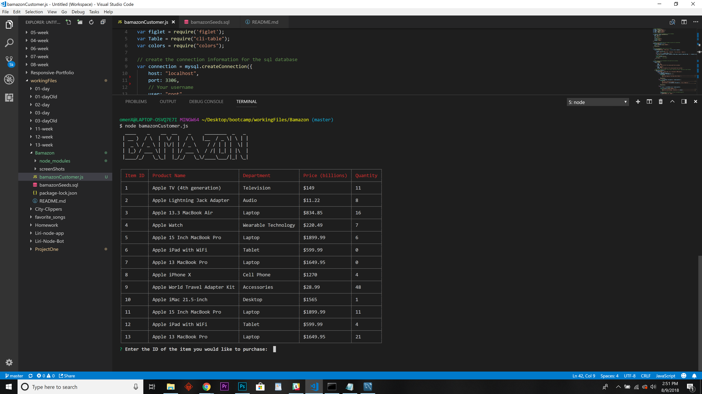

# Bamazon
Amazon-like Storefront  - Node.js &amp; MySQL -  CLI App

### :computer: Technologies Used 
 
* Node.js
* MySQL
* JavaScript
* Node Modules
	* Inquirer
	* CLI-table
	* Figlet
    * Colors 

### :dvd: Installation and Usage 

* Copy the MySQL script in the bamazondb.sql file to MySQL Workbench and run the script
* This will create the bamazon database and tables needed to run the modules

### :boom: Features

* bamazonCustomer.js will display a table of products and allow the user to purchase products.
* Users will be prompted to choose an item and the quantity needed. 
* Three responses are returned - 
    * Out of Stock. Try Again! 
    * This Item is Almost Out of Stock.
    * Thank You for your Purchase - Total Cost = $0000.00 

### Bamazon ScreensShots
mySQL Schema bamazonSeeds.sql

bamazonCustomer.js

Initial Table and Prompt

Out of Stock

Almost Out

Purchase Invoice

